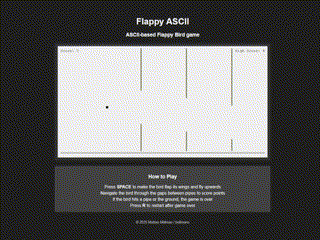

# :bird: Flappy ASCII

## :scroll: Introduction
A simple Flappy Bird game rendered entirely with ASCII characters. This project transforms the classic mobile game into a retro DOS-style experience, using only text characters to create the bird, pipes, and environment. The game features both dark and light modes, persistent high scores, and responsive design.

## :video_game: How to Play

- Press **SPACE** to make the bird flap its wings and fly upwards
- The bird automatically falls due to gravity
- Navigate through the gaps between pipes to score points
- Each successful pipe passage increases your score
- If the bird hits a pipe or the ground, the game ends
- Press **R** to restart after game over
- Try to beat your high score, which persists between sessions

## :computer: Play Online

This game is designed to be easily hosted on GitHub Pages. Click [here](https://bellmano.github.io/FlappyASCII) to play the game!

## :trophy: GIF from the gameplay

## :heart: Acknowledgments

This project was inspired by the original Flappy Bird game created by Dong Nguyen. The ASCII rendering approach pays homage to classic DOS-era games while bringing the addictive gameplay of Flappy Bird to a new format.

Enjoy this retro-style version of the classic Flappy Bird game!
